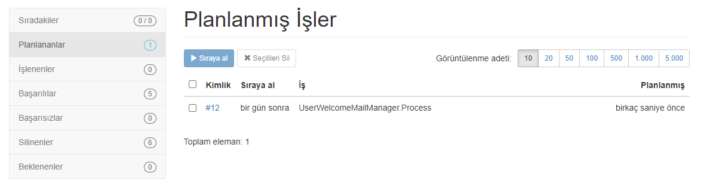
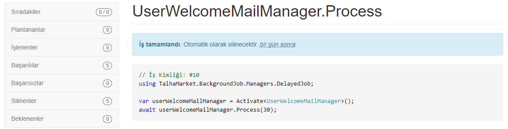
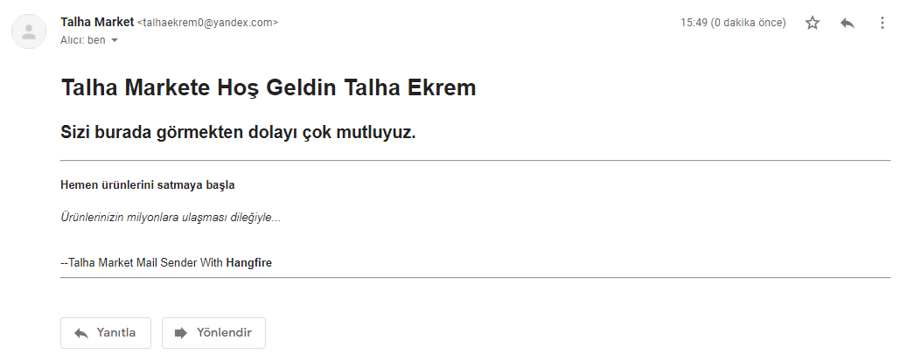

# odev-5-talhaekrem
## Bu ödevde admin arayüzüne kayıt, giriş, çıkış işlemlerini, yetki kontrolü, ürün - kategori için CRUD işlemleri yapabilmekteyiz. Kayıt olduktan sonra hoş geldin maili yollanmaktadır.
### Redis cache opsiyonel olduğu için kullanmadım.
---
* Yetki kontrolünü admin panelinde kullanıcıları listelemek için kullandım. Sadece Admin siteye üye olan kullanıcıları görüntüleyebilir. Editörler kullanıcıları görüntüleyemez.
* Login, SignUp, Logout, authorization işlemleri için dinamik olması açısından AspNet.Identity kullandım.
* Tablo kısmında listelenecek ürün, kategori ve kullanıcılar için sayfalama, filtreleme ve sıralama işlemlerini hazır olarak sunan DataTable kullandım.
* Background Job için hangfire kullandım.
#### Hangfire scheduled mail sending screen shots
Kayıt olduğunda tektiklenir ve 1 gün sonra çalışır


---
24 saat sonra iş başarıyla çalışır


---
Gelen mail içeriği



#### Hangfire kurulumu
* Yeni bir class library açıp Nuget Package Manager üzerinden Hangfireı indirin.
* Bu libraryde iş kollarınızı yazın [hangfire docs](https://docs.hangfire.io/en/latest/)
* Hangfireı kullanacağınız arayüzde class libraryi referanslara ekleyin ve arayüzünüzün startupında aşağıdaki işlemleri yapın.
  * Hangfireı yukarıda ekleyin.
  ```cs
  using Hangfire;
  ```
    
  * services kısmında veritabanı kurulumunu yapın
  ```cs
  services.AddHangfire(x => x.UseSqlServerStorage("<ConnectionStringin>"));
  services.AddHangfireServer();
  ```
  
  * arayüz isterseniz configure kısmına arayüzü çağırın.  
  ```cs
  app.UseHangfireDashboard();
  ```

**Bu işlemler sonucuda belirttiğiniz veritabanında hangfire kendi tablolarını oluşturacaktır.**

### LICENSE
---
[MIT](https://choosealicense.com/licenses/mit/)
